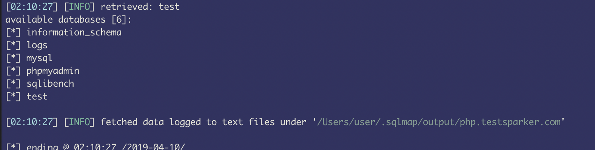
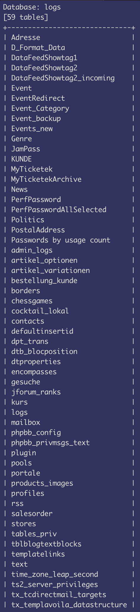

# 소스코드 점검 기준
## 1) OWASP (Open Web Application Security Project)
- 전 세계 기업, 교육기관 및 개인이 만들어가는 오픈 소스 어플리케이션 보안 프로젝트
- 1984년 4월 미국에서 비영리 단체로 출발
- OWASP TOP 10문서는 웹에서 발생할 수 있는 대표적인 취약점 10가지를 정리 & 3년 마다 갱신
- 책에서 설명하는 10가지 취약점 - OWASP Top 10 2017 RC
## 2) WASC (Web Application Security Consortium)
- 산업 전문가, 조직의 대표자 등의 전문가들로 구성
- 기술 정보, 기고된 논문, 보안 가이드라인, 그 밖에 유용한 문서등을 지속적으로 릴리즈
## 3) CVE (Common Vulnerabilities and Exposures)
- 국가기관(미국방성 등) 및 벤더사(CISCO, Apple, MS 등) 등이 함께 발생된 취약점을 넘버링하여 취약점을 관리하는 데이터베이스
- 번호 만드는 절차
  1. 잠재된 위험 발견 
  1. 해당 정보를 등록(CNA)하여 CVE 에디터에게 제안
  1. CVE를 처리하는 기관에서 논의를 거쳐 등록 결정
- 규칙: `CVE-연도-순서` 
  - ex) 2013년 첫 번째로 등록된 취약점: `CVE-2013-0001`
## 4) CWE (Common Weakness Enumeration)
- 미국방성 산하의 mitre라는 기관에서 다양한 개발언어에 대한 740여 가지의 소스코드 취약점을 정의한 데이터베이스
- 2010년에 "개발자가 가장 많이 실수하는 25가지 취약점"에 대해 `CWE/SANS TOP 25`라는 이름으로 릴리즈

### CWE/SANS TOP 25
| Rank | Score | ID | Name |
|---|---|---|---|
| 1 | 93.8 | CWE-89 | SQL Injection |
| 2 | 83.3 | CWE-78 | Command Injection |
| 3 | 79.0 | CWE-120 | Classic Buffer Overflow |
| 4 | 77.7 | CWE-79 | Cross-site Scripting (XSS) |
| 5 | 76.9 | CWE-306 | Missing authentication for critical function |
| 6 | 76.8 | CWE-862 | Missing authorization |
| 7 | 75.0 | CWE-798 | Use of Hard-coded Credentials |
| 8 | 75.0 | CWE-311 | Missing Encryption of Sensitive Data |
| 9 | 74.0 | CWE-434 | Unrestricted upload of file with dangerous type |
| 10 | 73.8 | CWE-807 | Reliance of untrusted inputs in a security decision |
| 11 | 73.1 | CWE-250 | Execution with Unnecessary privileges |
| 12 | 70.1 | CWE-352 | Cross-Site Request Forgery (CSRF) |
| 13 | 69.3 | CWE-22 | Improper Limitation of a Pathname to a Restricted Directory |
| 14 | 68.5 | CWE-494 | Download of Code Without Integrity Check |
| 15 | 67.8 | CWE-863 | Incorrect Authorization |
| 16 | 66.0 | CWE-829 | Inclusion of Functionality from Untrusted Control Sphere |
| 17 | 65.5 | CWE-732 | Incorrect Permission Assignment for Critical Resource |
| 18 | 64.6 | CWE-676 | Use of Potentially Dangerous Function |
| 19 | 64.1 | CWE-327 | Use of Broken or Risky Cryptographic Algorithm |
| 20 | 62.4 | CWE-131 | Incorrect Calculation of Buffer Size |
| 21 | 61.5 | CWE-307 | Improper Restriction of Excessive Authentication Attempts |
| 22 | 61.1 | CWE-601 | URL Redirection to Untrusted Site |
| 23 | 61.0 | CWE-134 | Uncontrolled Format String |
| 24 | 60.3 | CWE-190 | Integer Overflow or Wraparound |
| 25 | 59.9 | CWE-759 | Use of a One-Way hash without a Salt |

# Injection
## SQL Injection
- 외부 입력 값이 직접 쿼리에 삽입되는 Statement 방식의 경우, 공격 문자열에 의해 SQL 쿼리가 변조되기 때문에 SQL Injection에 취약하게 됨
- SQL 쿼리에 사용되는 파라미터가 변경될 때마다 전체를 다른 쿼리로 인식하기 때문에 공격 문자열도 함께 인식되는 취약점이 있음
### Statement vs PreparedStatement
- Statement
  - 외부 입력값이 쿼리값에 직접 삽입되는 취약한 구조
  - ```java
    String data1 = "외부 입력값1";
    String data2 = "외부 입력값2";
    String sql = "insert into member values('" + data1 + "', '" + data2 + ");"
    ```
- PreparedStatement
  - 위와는 다르게 직접적으로 변수를 지정하지 않고, ?로 표시하는 바인드 변수형태로 사용됨
  - 입력값은 setXXX 형태로 설정하여 입력을 처리하기 때문에 쿼리구조가 사전 컴파일됨
  - 즉, 외부의 악의적인 입력값에도 쿼리구조는 변경되지 않기 때문에 안전한 구조
  - ```java
    PreparedStatement pstmt = con.prepareStatement(sql);
    String sql = "insert into member values(?, ?)";
    pstmt.setString(1, data1);
    pstmt.setString(2, data2);
    ```

### 사례 1. Wordpress PHP 패키지 
- 헤더에 다음 값을 넘김 `X-Forwarded-For: ck_ips=(select user()) WHERE ck_comment_id=2#`
- 서버 소스
```php
...
if($row = @mysql_fetch_assoc($result))
...
1 : $ip = getenv("HTTP_X_FORWARDED_FOR") ? getenv("HTTP_X_FORWARDED_FOR") : gentenv("REMOTE_ADDR");
2 : if (strstr($row['ck_ips'], $ip)) {
        $duplicated = 1;
        $ck_ips = $row['ck_ips'];
    }
...
if (!$duplicated) {
4 : $query = "UPDATE `$table_name` SET ck_rating_$direction = '$rating', ck_ips = '" . $ck_ips . "' WHERE ck_comment_id = $k_id";
5 : $result = mysql_query($query)
```
- 포인트
  - '#' 으로 인해 sql이 다음과 같이 뒤에 부분이 주석처리 되어버림 
    ```sql
    UPDATE `wp_comment_rating` SET ck_rating_up = '2', ck_ips = '', ck_ips(select user()) WHERE ck_comment_id=2#WHERE ck_comment_id = 2
    ```
### 사례 2. Java
- 소스
```java
1 : public UserList Admin1(String year, String month, String strOrgani String strPartCd, int page) {
...
2 : if (strPartCd != null && !strPartCd.equals("")) {
        queryAdd = "\n AND C.PART_CD = '" + strPartCd + "'";
    }
...
3 : String query = "SELECT " + 
                    "\n XXX " + 
                    "\n FROM XXX " + " +
                    "\n WHERE XXX = " + queryAdd + ...
```
- 포인트
  - 2번에서 사용된 queryAdd 값이 3번에서 사용되고 있음

### 사례 3. MyBatis
- `#` vs `$`

    | 파마리터 처리부분 | 취약여부 |
    |---|---|
    | #{itemid} | SQL Injection에 취약하지 않음 |
    | ${itemid} | SQL Injection에 취약함  |
- 쿼리 비교
  - `#`: SELECT * FROM item WHERE 1 = 1 AND itemid like concat('%', #{keyword}, '%')
  - `$`: SELECT * FROM item WHERE 1 = 1 AND itemid like concat('%', ${keyword}, '%')
- parameter: `1%' UNION ALL SELECT NULL, NULL, NULL...`
  - `#`: SELECT * FROM item WHERE 1 = 1 AND itemid like concat('%', `?`, '%')
  - `$`: SELECT * FROM item WHERE 1 = 1 AND itemid like '%`1%' UNION ALL SELECT NULL, NULL, NULL...`  

# A1-Injection
## 1. SQL Injection
### 1) 에러 기반 SQL Injection
- GET, POST 요청필드, HTTP 헤더값, 쿠키값 등에 특수문자 (', ; 등)를 삽입 시, SQL 관련 에러를 통해 데이터베이스 정보를 예상
- RDB 별로 에러 메시지가 다르게 출력됨 
- ex
  - MSSQL: `~ Microsoft OLE DB Provider for ODBC Drivers error '80040e14' ~`
  - MySQL: `~ You have an error in your SQL syntax; check the manual ~`
  - Oracle: `~ ORA-00933: SQL command not properly ended ~`
  - PostreSQL: `~ Query failed: ERROR: syntax error at or near ~`
- 포인트: 응답 페이지에 위처럼 SQL 관련 에러가 나오거나 응답코드가 500번이면 취약점으로 판단
### 2) Union 기반 SQL Injection
- 원래의 요청에 추가 쿼리를 삽입하여 정보를 얻어냄
- 2개의 테이블이 동일한 필드개수와 데이터타입을 가져야 하므로 사전공격을 통해 해당 정보를 얻는 과정이 필요
- ex
  - `http://www.site.com/news.php?id=5 union all select 1,table_name,3 from information_schema.tables`
- 포인트: sqlmap에서는 null 패턴 삽입으로 쿼리개수를 파악하여 취약점 여부를 확인
### 3) Blind 기반 SQL Injection
- 에러가 발생하지 않는 사이트에서는 위의 기법들을 사용할 수 없음
- 공격을 통해 정상적인 쿼리여부를 가지고 취약점 여부를 판단하는 기법
- ex
  - `http://www.xxx.com/page.php?id=5 and 1=2`: 화면 출력 안됨
- 포인트: 다양한 true false 조건을 요청하여 페이지가 정상적으로 호출 되는지를 가지고 취약점 확인
### 4) Stored Procedure 기반 SQL Injection
- Stored Procedure: SQL 집합 형태
- 명령어 실행이 가능한 MSSQL의 xp_cmdshell을 악용하여 운영체제 명령어를 삽입하는 기법
- ex
  - `http://www.site.com/member/checkid.asp?id=';CREATE.....r.dbo.xp_cmdshell%20'netstat%20-an';`
### 5) 타임 기반 SQL Injection
- 쿼리 결과를 특정시간만큼 지연 시키는 것을 이용한 기법
- Blind 기법과 마찬가지로 에러가 발생되지 않는 조건에서 사용 가능
- ex
  - `http://testphp.vulnweb.com/listproducts.php?cat=1 AND SLEEP(5)`
- 포인트: 5초 뒤에 화면에 결과가 출력되면 취약점이 있는 것으로 판단

## 2. CRLF Injection
- CRLF: Carriage Return과 Line Feed -> 키보드의 엔터키와 동일한 기능
- URL 특정 파라미터에 해당 코드를 삽입하는 경우 임의의 헤더정보를 생성할 수 있는 취약점 발생
- ex
  - CRLF(`%0D%0A`), 스페이스(`%20`)
  ```
  GET /redir.php?url=%0D%0A%20New_Header:New_Header_Value%0D%0A
  HTTP/1.1
  Host: www.example.com
  ...
  ```
- 포인트: 응답코드 302번 및 Location 헤더에 삽입한 공격 문자열이 보이면 취약점 있는 것
```
HTTP/1.1 302 Found
Date: Tue, 23 Aug 2011 18:34:36 GMT
Server: Apache/1.3.33 (Win32) PHP/5.0.2 X-Powered-By: PHP/5.0.2
Location: NEW_Header: New_Header_Value ...
```

## 3. Command Injection
- GET, POST 요청필드, HTTP 헤더값, 쿠키값 등에 운영체제 명령어를 삽입하여 권한을 획득하는 공격
- ex
  - `/cgi/bin/shoppingcart.cgi?id=1020&page=|cat /etc/passwd&pid=A1023`
- 점검 방법: 매일 릴리즈 되는 취약점 정보를 활용하여 사용 중인 시스템의 취약점을 확인
- https://www.exploit-db.com/remote에서 Zero-day(최신 취약점)에 관련된 정보 제공
- 포인트: OS 명령어의 결과가 출력되면 취약점 있는 것

# 모의해킹 실전 2
## A1 - Injection
### SQL Injection
- 데이터베이스 조회: `python sqlmap.py -u "http://php.testsparker.com/artist?id=1" -p "id" --level=3 --risk=3 --threads=10 --dbs`
  - 
- logs DB의 테이블명 알아보기: `python sqlmap.py -u "http://php.testsparker.com/artist?id=1" -p "id" --level=3 --risk=3 --threads=10 -D logs --tables --dump --hex`
  - 
- logs 테이블의 데이터 획득: `python sqlmap.py -u "http://php.testsparker.com/artist?id=1" -p "id" --level=3 --risk=3 --threads=10 -D logs -T logs --dump --hex`
  - 
### Command Injection
